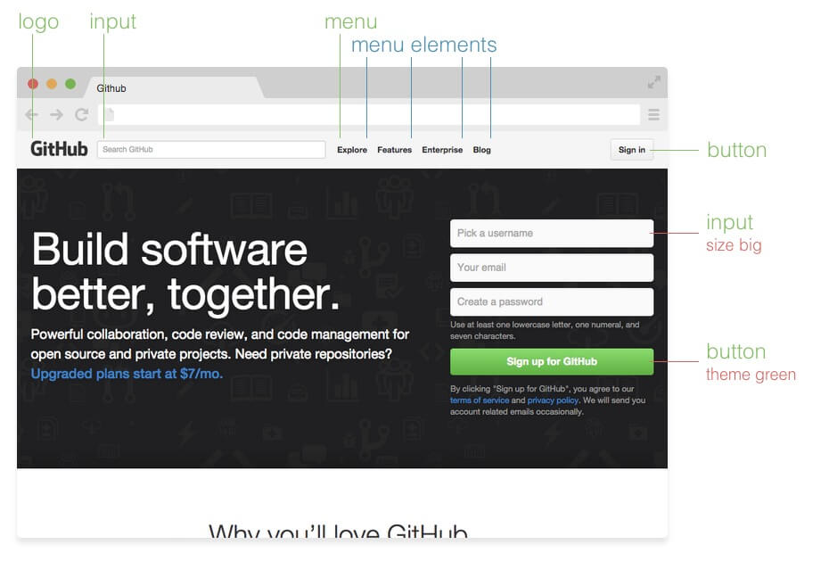

# Introduction

[原文](http://getbem.com/introduction/)

On smaller brochure sites, how you organize your styles isn’t usually a big concern. You get in there, write some CSS, or maybe even some SASS. You compile it all into a single stylesheet with SASS’s production settings, and then you aggregate it to get all the stylesheets from modules into a nice tidy package.

However, when it comes to larger, more complex projects, how you organize your code is the key to efficiency in at least these three ways: it affects how long it takes you to write code, how much of that code you’ll have to write and how much loading your browser will have to do. This becomes especially important when you’re working with teams of themers, and when high performance is essential.

This is also true for long-term projects with legacy code (read ["How to Scale and Maintain Legacy CSS with Sass and SMACSS"](http://webuild.envato.com/blog/how-to-scale-and-maintain-legacy-css-with-sass-and-smacss/) — some nice SMACSS and BEM mixing in there).

## Methodologies

There are plenty of [methodologies](https://github.com/ikkou/awesome-css#architecture) out there aiming to reduce the CSS footprint, organize cooperation among programmers and maintain large CSS codebases. This is obvious in large projects like Twitter, Facebook and [Github](http://markdotto.com/2014/07/23/githubs-css/#two-bundles), but other projects often grow into some “Huge CSS file” state pretty quickly.


#### [OOCSS](http://oocss.org/)

Separating container and content with CSS “objects”


#### [SMACSS](http://smacss.com/)

Style-guide to write your CSS with five categories for CSS rules


#### [SUITCSS](http://suitcss.github.io/)

Structured class names and meaningful hyphens


#### [Atomic](http://github.com/nemophrost/atomic-css)

Breaking down styles into atomic, or indivisible, pieces


## Why BEM over the others?

No matter what methodology you choose to use in your projects, you will benefit from the advantages of more structured CSS and UI. Some styles are less strict and more flexible, while others are easier to understand and adapt in a team.

> The reason I choose BEM over other methodologies comes down to this: it is less confusing than the other methods (i.e. SMACSS) but still provides us the good architecture we want (i.e. OOCSS) and with a recognizable terminology.
> 
> Mark McDonnell, [Maintainable CSS with BEM](http://www.integralist.co.uk/posts/bem.html#4)

## Blocks, Elements and Modifiers

You will not be surprised to hear that BEM is an abbreviation of the key elements of the methodology — Block, Element and Modifier. BEM’s strict naming rules can be found [here](http://getbem.com/naming/).


### Block

Standalone entity that is meaningful on its own.

##### Examples

`header`, `container`, `menu`, `checkbox`, `input`


### Element

A part of a block that has no standalone meaning and is semantically tied to its block.

##### Examples

`menu item`, `list item`, `checkbox caption`, `header title`


### Modifier

A flag on a block or element. Use them to change appearance or behavior.

##### Examples

`disabled`, `highlighted`, `checked`, `fixed`, `size big`, `color yellow`




## Under the hood

Let’s look how one particular element on a page can be implemented in BEM. We will take `button` from [GitHub](http://primercss.io/buttons/):


We can have a normal button for usual cases, and two more states for different ones. Because we style blocks by class selectors with BEM, we can implement them using any tags we want (`button`, `a` or even `div`). The naming rules tell us to use `block--modifier-value` syntax.


#### HTML
```
<button class="button">
	Normal button
</button>
<button class="button button--state-success">
	Success button
</button>
<button class="button button--state-danger">
	Danger button
</button>
```


#### CSS

```
.button {
	display: inline-block;
	border-radius: 3px;
	padding: 7px 12px;
	border: 1px solid #D5D5D5;
	background-image: linear-gradient(#EEE, #DDD);
	font: 700 13px/18px Helvetica, arial;
}
.button--state-success {
	color: #FFF;
	background: #569E3D linear-gradient(#79D858, #569E3D) repeat-x;
	border-color: #4A993E;
}
.button--state-danger {
	color: #900;
}
```


## Benefits


#### Modularity

Block styles are never dependent on other elements on a page, so you will never experience [problems from cascading](http://www.phase2technology.com/blog/used-and-abused-css-inheritance-and-our-misuse-of-the-cascade/).

You also get the ability to transfer blocks from your finished projects to new ones.


#### Reusability

Composing independent blocks in different ways, and reusing them intelligently, reduces the amount of CSS code that you will have to maintain.

With a set of style guidelines in place, you can build a library of blocks, making your CSS super effective.


#### Structure

BEM methodology gives your CSS code a solid structure that remains simple and easy to understand.


## Further Reading

* [‘Why BEM?’ in a nutshell](http://blog.decaf.de/2015/06/24/why-bem-in-a-nutshell/)
* [MindBEMding](http://csswizardry.com/2013/01/mindbemding-getting-your-head-round-bem-syntax/) — getting your head ’round BEM syntax
* [CSS guidelines](http://cssguidelin.es/#bem-like-naming)
* [BEM methodology for small projects](http://www.smashingmagazine.com/2014/07/17/bem-methodology-for-small-projects/)
* [BEM It! for Brandwatch](http://www.slideshare.net/MaxShirshin/bem-it-for-brandwatch)
* [Used and Abused](http://www.phase2technology.com/blog/used-and-abused-css-inheritance-and-our-misuse-of-the-cascade/) — CSS Inheritance and Our Misuse of the Cascade.
* [Objects in Space](https://medium.com/objects-in-space/objects-in-space-f6f404727) — A style-guide for modular SASS development using SMACSS and BEM
* [How to Scale and Maintain Legacy CSS with Sass and SMACSS](http://webuild.envato.com/blog/how-to-scale-and-maintain-legacy-css-with-sass-and-smacss/)
* [Building a modular My Health Skills with BEM and Sass](http://www.bluegg.co.uk/building-my-health-skills-part-3/)
* [Building My Health Skills — Part 3](http://www.bluegg.co.uk/building-my-health-skills-part-3/)

## Case study

We hope to write "How to migrate an existing project to BEM" soon. In the meantime you can watch this nice presentation by Nicole Sullivan — "[CSS preprocessor performance](http://www.youtube.com/watch?v=0NDyopLKE1w)". She gives a very good overview of the problems she encounters in the majority of websites and offers ways to track them down and handle them.


