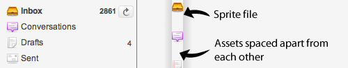
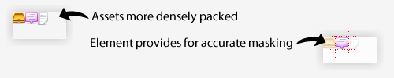

# The Icon Module

[原文](https://smacss.com/book/icon-module)

CSS sprites have become a mainstay of modern web development—and for good reason. They allow for multiple assets to be compiled into a single resource, minimizing the number of HTTP requests and ensuring that images for things like rollover states are already loaded when needed.

Before sprites came along, images would be used in two different contexts: as a background image, allowing other things to layer on top of it; or as a foreground image, residing inline with text. With sprites, everything is now a background image and positioned within the mask of the element.

It is this latter scenario that this chapter will be specifically addressing.

This will be best explained with an example, so let's look at a menu with its accompanying icons.


Menu of items with icons




Menu HTML

```
<ul class="menu">
    <li class="menu-inbox">Inbox</li>
    <li class="menu-drafts">Drafts</li>
</ul> 
```


The HTML is straightforward. We have a list of menu items. A class is added to each menu item so that we can style each one differently.


Menu CSS

```
.menu li {
    background: url(/img/sprite.png) no-repeat 0 0;
    padding-left: 20px;
}

.menu .menu-inbox {
    background-position: 0 -20px;
}

.menu .menu-drafts {
    background-position: 0 -40px;
}

```


All list items are set to the single sprite and then each individual list item repositions the background to show the correct icon.

On the surface, this looks pretty good and it worked for us, for the most part. As always, we began to run into edge cases where this complicated matters.

* We became reliant on a very specific HTML structure: the list item.
* Sprites had to be redefined to be used in other modules.
* Positioning within the element was very fragile: bumping up font size could reveal other parts of the sprite.
* Handling right-to-left interfaces was more difficult since we could only use horizontal sprites and fix the x position to 0.

To resolve these issues, we moved to where the icon itself became a module: the icon module.


Restructuring the HTML to create the icon module

```
<li><i class="ico ico-16 ico-inbox"></i> Inbox</li> 
```


Many people would likely balk at the use of the `i` tag. I chose to use it because it was small, mostly devoid of semantics, and was an empty element with no content. Why is there no content? In this example, the icon supports the visible text beside it. If the icon were to sit alone, then we would add a title attribute so that it could be read by a screen reader or used as a tooltip. If you disagree and feel a span is more appropriate, I'll understand.

By having a single tag with the various icon classes applied to it, it no longer has any other HTML dependencies. That's good. But why three different classes? Each plays a slightly different role and all ultimately come together to mimic a traditional `img` element.


Icon Module CSS

```
.ico {
    display: inline-block;
    background: url(/img/sprite.png) no-repeat;
    line-height: 0;
    vertical-align: bottom;
}

.ico-16 {
    height: 16px;
    width: 16px;
}

.ico-inbox {
    background-position: 20px 20px;
}

.ico-drafts {
    background-position: 20px 40px;
}

```


The `ico` class defines the basics of turning the element into an inline-block element, which is what an image is. You may need to adjust `vertical-align` so that the icon sits relative to the text correctly. Internet Explorer has issues with applying `inline-block` to block elements. Since we're applying it to an inline element, it doesn't have the same issue. Alternatively, you can use `{ zoom:1; display:inline; }` for block elements in IE to behave like inline-block elements.

The `ico-16` class sets the height and width. If your project only has one size of icon, you could define the size in the `ico` class. If every icon has a different size, you can define it in the class for the specific icon. For this project, we had sets of icons in about four different sizes.

The last class, `ico-inbox`, positions the sprite to the correct coordinates. By having a fixed icon size, there's no longer a concern of the parent element growing too large and we can use the same code for right-to-left interfaces without having to modify the background position.


Densely packed image sprite



A more densely packed image also allows for better compression. Smaller file sizes will improve the performance of your site. (And if you're not already, I recommend using Yahoo!'s [Smush.it](http://www.smushit.com/ysmush.it/) service or [ImageOptim](http://imageoptim.pornel.net/) for the Mac to ensure your images are as small as possible.)

We've just looked at an example of how to refactor a specific part of a project to make things more flexible. There are many ways to approach a problem and what looks like it'll work on the surface can run into problems further into a project. Projects evolve as complexities reveal themselves and part of the fun in doing web development is deciding how best to solve these problems.

