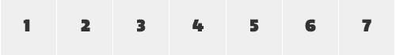

# Complicated Inheritance

[原文](https://smacss.com/book/inheritance)

This chapter looks at how inheritance can sometimes cause our best laid plans to run afowl.

In this example, we will take a look at a Calendar that uses generic State rules that conflict with the inheritance within the table cells and how to possibly work around the problem.


Calendar Table

```
<table class="cal">
    <tr>
        <td>1</td>
        <td>2</td>
        <td>3</td>
        <td>4</td>
        <td>5</td>
        <td>6</td>
        <td>7</td>
    </tr>
    <!-- repeated 3-4 times -->
</table>

```


The calendar consists of a table with rows and columns. Each cell is a single day. The default style is is how a day cell should look under normal circumstances.


The Day Cell

```
.cal td {
    background-color: #EFEFEF;
    color: #333;
}

```



Each cell in my table has a light gray background with dark gray text. Now, we want to highlight which day is *today*.


Styling Today

```
.cal td.cal-today {
    background-color: #F33;
    color: #000;
}

```


The `cal-today` class shows that the today class is part of the `cal`module. We are also increasing the specificity which will have this style override the default style. Alternative selector choices could’ve included just a plain `td.cal-today` which would have worked as long as it was declared after the default state rule. Had we used just `.cal-today` as our selector, we would’ve had to resort to using `!important`to get this style to work.

It is important to recognize that there are small decisions that have to be made like this as the project develops. In the direction I chose, I’m saying that the `.cal-today` class can only be applied on a table cell (`<td>`) and that it would be inside an element with the `cal` class (which, using SMACSS, should be considered a given).

Getting back to our example, everything looks good. Now, our calendar is a smaller view that is connected to a larger view that shows a week in full detail. Our miniature calendar needs to show which week is the currently selected week.


Selected Row

```
<tr class="is-selected">
    <td>1</td>
    <td class="cal-today">2</td>
    <td>3</td>
    ...
</tr>

```


The selected state is being used throughout the application and so it only made sense to use it here. What does the selected style look like?


Selected Row Rule

```
.is-selected {
    background-color: #FFD700; /* Yellow */
    color: #000;
}
```


Can you see the problem? The problem is that the background colour applies to the table row while the color inheritance gets overridden by the greater specificity of both the base day style and the today style.

I could add `!important` to my state, which I have mentioned above as being an acceptable thing to do, but while it increases the specificity when applying the style to the same element, it doesn’t help us here because it won’t be inherited down to the cell. `!important` does not override inheritance, just specificity.

That means I need to create new rules to allow the selected state to be reflected on child elements.


Selected Row Rule for Table Cells

```
.is-selected td {
    background-color: #FFD700; /* Yellow */
    color: #000;
}
```


If this selector is defined after our calendar day selectors then everything should render just as we would expect.

What colour will our cells be now? That depends. Was this style declared before or after the `cal` classes? If it was after, then all cells in the row will be styled correctly. Our today cell will still be coloured in red, which, on this particular project, was exactly what we wanted.

## Where !important can go wrong

For argument’s sake, what if we added the `!important` rule to our select cell CSS? Suddenly our today cell would no longer show today; it would be styled like the rest of the week.


What adding `!important` would do

```
.is-selected td {
    background-color: #FFD700 !important; /* Yellow */
    color: #000 !important;
}
```


To get the today cell styled correctly, we would have to create a new rule that combines the state rule with the module rule.


Adding extra rules to work around specificity

```
.is-selected td {
    background-color: #FFD700 !important; /* Yellow */
    color: #000 !important;
}

.is-selected td.cal-today {
    background-color: #F33 !important;
    color: #000 !important;
}

```


From this last example, you can see that we are having to add more selectors and more `!important` to keep things working correctly. This is definitely not ideal.

## An Imperfect World

The purpose of this example was to demonstrate that inheritance can wreak some havoc on our well-laid plans and there isnʼt a perfect solution. SMACSS tries to mitigate many of these problems but at the end of the day, sometimes you still have to create some less-than-ideal solutions.

Minimizing the number of situations like these will still help keep your project more maintainable.

