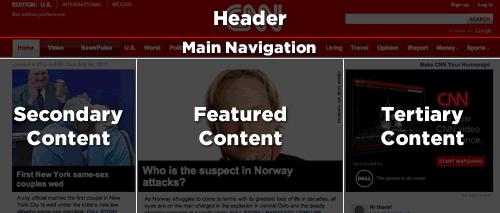
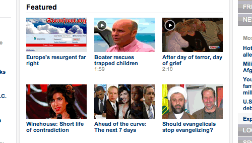

# 布局规范（Layout Rules）

[原文](https://smacss.com/book/type-layout)

CSS, by its very nature, is used to lay elements out on the page. However, there is a distinction between layouts dictating the major and minor components of a page. The minor components—such as a callout, or login form, or a navigation item—sit within the scope of major components such as a header or footer. I refer to the minor components as Modules and will dive into those in the next section. The major components are referred to as Layout styles.

CSS本质上来说就是在页面上用来布局元素的。 但是，在一个页面中，布局的主要和次要的组件之间是有区别的。 次要组件（例如标注，登录表单或导航项目）位于主要组件（如页眉或页脚）之中。 我将次要组件称之为模块，并将在下一节中进行深入讨论。 （在此，我们主要讨论主要组件）主要组件被称为布局样式。

Layout styles can also be divided into major and minor styles based on reuse. Major layout styles such as header and footer are traditionally styled using ID selectors but take the time to think about the elements that are common across all components of the page and use class selectors where appropriate.

布局样式也可以根据重用情况分为主要样式和次要样式。 主要的布局样式（如页眉和页脚）通常使用ID选择器进行样式布局，但是我们也要花时间考虑页面所有组件中通用的部分，并在适当的地方使用类选择器进行布局。

布局声明（Layout declarations）

```
#header, #article, #footer {
    width: 960px;
    margin: auto;
}

#article {
    border: solid #CCC;
    border-width: 1px 0 0;
}

```

Some sites may have a need for a more generalized layout framework (for example, [960.gs](http://960.gs/)). These minor Layout styles will use class names instead of IDs so that the styles can be used multiple times on the page.

有些网站可能需要更通用的布局框架（例如，[960.gs](http://960.gs/)）。 这些次要的布局样式会使用类来命名而不是ID来命名，以便使样式可以在页面上多次使用。

Generally, a Layout style only has a single selector: a single ID or class name. However, there are times when a Layout needs to respond to different factors. For example, you may have different layouts based on user preference. This layout preference would still be declared as a Layout style and used in combination with other Layout styles.

通常，一个布局的样式只有一个选择器：使用单一的ID或类来命名。 但是，有时候布局需要对不同的情况做出不同的反应。 例如，您可能根据用户偏好设置不同的布局。 布局主要表现的内容被称作布局样式，并可以与其他布局样式结合使用。

Use of a higher level Layout style affecting other Layout styles.

使用更高级别布局样式来改变其他的布局样式。

```
#article {
    float: left;
}

#sidebar {
    float: right;
}

.l-flipped #article {
    float: right;
}

.l-flipped #sidebar {
    float: left;
}

```

In the Layout example, the .l-flipped class is applied on a higher level element such as the body element and allows the article and sidebar content to be swapped, moving the sidebar from the right to the left and vice versa for the article.

在布局示例中，类名为.l-flipped的类被应用于级别更高的元素上（例如body元素），并允许文章和侧边栏的内容进行交换，或者将文章右边栏的内容移动到左边，反之亦然。

Using two Layout styles together to switch from fluid to fixed layout.

同时使用两个布局样式将页面从流式布局切换到固定布局。

```
#article {
    width: 80%;
    float: left;
}

#sidebar {
    width: 20%;
    float: right;
}

.l-fixed #article {
    width: 600px;
}

.l-fixed #sidebar {
    width: 200px;
}

```


In this last example, the `.l-fixed` class modifies the design to change the layout from fluid (using percentages) to fixed (using pixels).

在最后一个示例中，通过对`.l-fixed`类进行了修改，将布局从流式布局（使用百分比）更改为固定布局（使用像素）。

One other thing to note in the Layout example is the naming convention that I have used. The declarations that use ID selectors are named accurately and with no particular namespacing. The class-based selectors, however, *do* use an `l-` prefix. This helps easily identify the purpose of these styles and separate them from Modules or States. Layout styles are the only primary category type to use ID selectors, if you choose to use them at all. If you wish to namespace your ID selectors, you can, but it is not as necessary to do so.

布局示例中另外需要注意的点是我使用的命名规范。ID选择器的命名要求是精准的，并且没有特定的命名空间。然而，我们还是会基于类的选择器使用一个`l-`前缀。 这有助于轻松识别这些样式的目的，并将它们与模块或状态分开。如果您选择使用ID选择器，那布局样式是您唯一需要进行修改的样式类别。 如果您想命名您自己的ID选择器，您也可以这样做，但这没有必要。

#### 使用ID选择器（Using ID selectors）

To be clear, using ID attributes in your HTML can be a good thing and in some cases, absolutely necessary. For example, they provide efficient hooks for JavaScript. For CSS, however, ID selectors aren’t necessary as the performance difference between ID and class selectors is nearly non-existent and can make styling more complicated due to increasing specificity.

需要声明的是，在HTML中使用ID属性是一件好事，并且在某些情况下，这是绝对有必要的。 例如，他们会为JavaScript提供了高效的钩子。 然而，对于CSS而言，ID选择器并不是必要的，因为ID和类选择器之间的表现几乎没有什么区别，并且由于ID的淡一些，可能会使得样式更加复杂。

#### 布局范例（Layout Examples）

Theory is one thing but application is another. Let’s take a look at an actual web site and consider what is part of the layout and what is a module.

理论是一回事，但应用是另一回事。 让我们来通过一个实际的网站，来看看你什么是布局，而什么又是模块。


In taking a look at the CNN web site, there are a number of patterns that occur in plenty of web sites. For example, there is a header, a navigation bar, a content area and a footer (not seen in the screenshot).

通过观看CNN网站，我们发现在很多网站上会出现了一些相似的样式。 例如，它们都有一个标题，一个导航栏，一个内容区域和一个页脚（截图中未显示）。



At the time of this writing, the web site follows very closely to this break down and provides ID attributes for these major sections.

在写这篇文章的时候，这些网站都非常关注这些细节，并为这些主要部分提供了ID属性。

Our CSS structure might look something like this:

我们的CSS结构可能看起来像这个样子：

```
#header { … }
#primarynav { … }
#maincontent { … }

<div id="header"></div>
<div id="primarynav"></div>
<div id="maincontent"></div>

```

That was straightforward and I’m sure you are thinking, “Really? You’re showing me how to do this?!” Let’s take a look at another part of the page.

这很直接明了，并且我相信您肯定在想：“这是真的吗？ 你在告诉我如何做出这样的网站？！”好吧，让我们来看看页面的另一部分。



Taking a look at the Featured section, we see a grid of news items. CNN’s current markup is a container `div` with a series of child `div`s. I would have likely gone with an unordered list, so let’s do that instead.

让我们看看这些有特色的部分，我们看到一个新闻栏目的网格。 CNN目前的样式布局是使用一个包括一系列子`div`的容器`div`。我认为可以用一个无序的列表来实现这样的效果。所以让我们这样做吧。

Example HTML code for the Featured section layout

特色部分布局的HTML代码范例

```
<div>
<h2>Featured</h2>
<ul>
    <li><a href="…">…</a></li>
    <li><a href="…">…</a></li>
    …
</ul>
</div>

```

Without considering the SMACSS approach to this, we might be inclined to add an ID of `featured` to the surrounding DIV and then style up the contents from there.

在不考虑SMACSS方法的情况下，我们比较倾向于为包裹的DIV添加一个ID的`特性`，然后对它进行设计内容。

A possible approach to styling the list of featured items

一种可以用来设计具有特点的列表的方法

```
div#featured ul { 
    margin: 0;
    padding: 0;
    list-style-type: none;
}

div#featured li {
    float: left;
    height: 100px;
    margin-left: 10px;
}

```

There are some assumptions that we make with this approach:

1. There will only ever be one featured section on the page
2. List items are floated to the left
3. List items have a height of 100 pixels

我们通过这种方法做出了一些假设：

1. 在页面上只会有一个具有特点的部分
2. 列表浮动在左侧部分
3. 列表的高度为100像素

These may be reasonable assumptions to make. This is a prime example of where a small site can get away with this structure: it is unlikely to change and it is unlikely to become more complex than it already is. *Maybe.* Larger sites with a higher rate of change just have a higher chance of refactoring a component within the page and needing to readdress the styling that goes with it.

这些可能是合理的假设。 因为这是一个小型网站可以摆脱这种结构的典型例子：它不太可能改变现在的结构，也不可能变得比现在更复杂。也许。更大的站点会有更大的几率改变结构，在页面内有更高的几率重构组件，并且需要重新编写与之相关的样式。

Looking back at the code example, there are definitely some optimizations that could be made. The ID selector didn’t need to be qualified with a tag selector, too, and since the list is a direct descendant of the `div`, the child selector (>) could’ve been used.

现在回顾一下代码案例，肯定会有一些优化需要做。 ID选择器不需要用标签选择器进行限制，并且由于列表是`div`的直接子元素，所以我们也可以使用子选择器（>）。

Let’s take a look at how this could be readdressed to give us some more flexibility.

让我们来看看这个范例可以如何进行修改，以便给我们的操作带来更多的灵活性。

From a layout perspective, all we care about is how each item relates to each other. We don’t care, necessarily, about the design of the modules themselves nor do we want to have to worry about the context that this layout sits within.

从布局的角度来看，我们关心的是每个部分之间如何关联。 我们没有必要关心模块本身的设计，也不需要担心这个布局的环境。

使用OL或者UL的网格模块（Grid Module applied to OL or UL.）

```
.l-grid {
    margin: 0;
    padding: 0;
    list-style-type: none;
}

.l-grid > li {
    display: inline-block;
    margin: 0 0 10px 10px; 

    /* IE7 hack to mimic inline-block on block elements */
    *display: inline;
    *zoom: 1;
}

```

What problems were solved with this approach and what problems did we introduce? (Very rarely does *any* solution solve 100% of the problem.)

1. The grid layout can now be applied to any container to create a float-style layout
2. We have decreased the *depth of applicability* by 1 (See the chapter on Depth of Applicability for more on that)
3. We have reduced the specificity of the selectors
4. The height requirement has been removed. A particular row will grow to the height of the tallest item in that row.

通过这种方法，我们可以解决哪些问题，又会因此引入哪些问题呢？（几乎没有任何一种解决方法可以解决100%的问题。）

1. 网格布局现在可以应用于任何容器来创建浮动式布局
2. 我们已经将适用性的深度减了1（若想了解更多，请参考适用性深度一章）
3. 我们降低了选择器的特殊性
4. 高度的要求已经被删除。 特定的行的高度会由到该行中最高的元素的高度决定。

On the flip-side, how did we make things worse?

1. By using a child selector, we are locking out IE6\. (We could get around this by avoiding the child selector.)
2. The CSS has increased in size and in complexity.

另一方面，我们又会造成什么问题？

1. 通过使用子代选择器，我们不会兼容IE6。（我们可以通过避免使用子代选择器来解决这个问题。）
2. CSS的体积和复杂度都在增加。

The increase in size can’t be disputed but it is nominal. Now that we have this reusable module, we can apply it throughout the site without code duplication. The increase in complexity is also nominal. We did have to work around outdated browsers and thrown in hacks that may be frowned upon by some. However, the selectors are less complex which allow us to extend this layout while still minimizing the impact of specificity.

CSS的体积会增加，这是肯定的，但这是理论上的分析。 现在我们有了这个可重用的模块，我们可以将它应用到整个站点而不用担心代码的重复使用。 同样，复杂性的增加也是理论性的。 我们的确需要保证代码在过时的浏览器上可以正常工作，并且可能会被产生的一系列的问题所困扰。 但是，选择器可以让我们在不太复杂的情况下能够扩展这样的布局，同时保证造成的影响最小。
