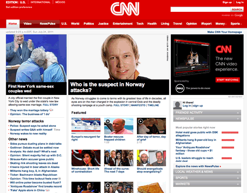

# Layout Rules

[原文](https://smacss.com/book/type-layout)

CSS, by its very nature, is used to lay elements out on the page. However, there is a distinction between layouts dictating the major and minor components of a page. The minor components—such as a callout, or login form, or a navigation item—sit within the scope of major components such as a header or footer. I refer to the minor components as Modules and will dive into those in the next section. The major components are referred to as Layout styles.

Layout styles can also be divided into major and minor styles based on reuse. Major layout styles such as header and footer are traditionally styled using ID selectors but take the time to think about the elements that are common across all components of the page and use class selectors where appropriate.


Layout declarations

```
#header, #article, #footer {
    width: 960px;
    margin: auto;
}

#article {
    border: solid #CCC;
    border-width: 1px 0 0;
}

```


Some sites may have a need for a more generalized layout framework (for example, [960.gs](http://960.gs/)). These minor Layout styles will use class names instead of IDs so that the styles can be used multiple times on the page.

Generally, a Layout style only has a single selector: a single ID or class name. However, there are times when a Layout needs to respond to different factors. For example, you may have different layouts based on user preference. This layout preference would still be declared as a Layout style and used in combination with other Layout styles.


Use of a higher level Layout style affecting other Layout styles.

```
#article {
    float: left;
}

#sidebar {
    float: right;
}

.l-flipped #article {
    float: right;
}

.l-flipped #sidebar {
    float: left;
}

```


In the Layout example, the .l-flipped class is applied on a higher level element such as the body element and allows the article and sidebar content to be swapped, moving the sidebar from the right to the left and vice versa for the article.


Using two Layout styles together to switch from fluid to fixed layout.

```
#article {
    width: 80%;
    float: left;
}

#sidebar {
    width: 20%;
    float: right;
}

.l-fixed #article {
    width: 600px;
}

.l-fixed #sidebar {
    width: 200px;
}

```


In this last example, the `.l-fixed` class modifies the design to change the layout from fluid (using percentages) to fixed (using pixels).

One other thing to note in the Layout example is the naming convention that I have used. The declarations that use ID selectors are named accurately and with no particular namespacing. The class-based selectors, however, *do* use an `l-` prefix. This helps easily identify the purpose of these styles and separate them from Modules or States. Layout styles are the only primary category type to use ID selectors, if you choose to use them at all. If you wish to namespace your ID selectors, you can, but it is not as necessary to do so.

#### Using ID selectors

To be clear, using ID attributes in your HTML can be a good thing and in some cases, absolutely necessary. For example, they provide efficient hooks for JavaScript. For CSS, however, ID selectors aren’t necessary as the performance difference between ID and class selectors is nearly non-existent and can make styling more complicated due to increasing specificity.

#### Layout Examples

Theory is one thing but application is another. Let’s take a look at an actual web site and consider what is part of the layout and what is a module.



In taking a look at the CNN web site, there are a number of patterns that occur in plenty of web sites. For example, there is a header, a navigation bar, a content area and a footer (not seen in the screenshot).


At the time of this writing, the web site follows very closely to this break down and provides ID attributes for these major sections.


Our CSS structure might look something like this:

```
#header { … }
#primarynav { … }
#maincontent { … }

<div id="header"></div>
<div id="primarynav"></div>
<div id="maincontent"></div>

```


That was straightforward and I’m sure you are thinking, “Really? You’re showing me how to do this?!” Let’s take a look at another part of the page.


Taking a look at the Featured section, we see a grid of news items. CNN’s current markup is a container `div` with a series of child `div`s. I would have likely gone with an unordered list, so let’s do that instead.


Example HTML code for the Featured section layout

```
<div>
<h2>Featured</h2>
<ul>
    <li><a href="…">…</a></li>
    <li><a href="…">…</a></li>
    …
</ul>
</div>

```


Without considering the SMACSS approach to this, we might be inclined to add an ID of `featured` to the surrounding DIV and then style up the contents from there.


A possible approach to styling the list of featured items

```
div#featured ul { 
    margin: 0;
    padding: 0;
    list-style-type: none;
}

div#featured li {
    float: left;
    height: 100px;
    margin-left: 10px;
}

```


There are some assumptions that we make with this approach:

1. There will only ever be one featured section on the page
2. List items are floated to the left
3. List items have a height of 100 pixels

These may be reasonable assumptions to make. This is a prime example of where a small site can get away with this structure: it is unlikely to change and it is unlikely to become more complex than it already is. *Maybe.* Larger sites with a higher rate of change just have a higher chance of refactoring a component within the page and needing to readdress the styling that goes with it.

Looking back at the code example, there are definitely some optimizations that could be made. The ID selector didn’t need to be qualified with a tag selector, too, and since the list is a direct descendant of the `div`, the child selector (>) could’ve been used.

Let’s take a look at how this could be readdressed to give us some more flexibility.

From a layout perspective, all we care about is how each item relates to each other. We don’t care, necessarily, about the design of the modules themselves nor do we want to have to worry about the context that this layout sits within.


Grid Module applied to OL or UL.

```
.l-grid {
    margin: 0;
    padding: 0;
    list-style-type: none;
}

.l-grid > li {
    display: inline-block;
    margin: 0 0 10px 10px; 

    /* IE7 hack to mimic inline-block on block elements */
    *display: inline;
    *zoom: 1;
}

```


What problems were solved with this approach and what problems did we introduce? (Very rarely does *any* solution solve 100% of the problem.)

1. The grid layout can now be applied to any container to create a float-style layout
2. We have decreased the *depth of applicability* by 1 (See the chapter on Depth of Applicability for more on that)
3. We have reduced the specificity of the selectors
4. The height requirement has been removed. A particular row will grow to the height of the tallest item in that row.

On the flip-side, how did we make things worse?

1. By using a child selector, we are locking out IE6\. (We could get around this by avoiding the child selector.)
2. The CSS has increased in size and in complexity.

The increase in size can’t be disputed but it is nominal. Now that we have this reusable module, we can apply it throughout the site without code duplication. The increase in complexity is also nominal. We did have to work around outdated browsers and thrown in hacks that may be frowned upon by some. However, the selectors are less complex which allow us to extend this layout while still minimizing the impact of specificity.

