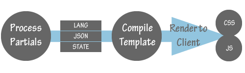

# 原型（Prototyping）

[原文](https://smacss.com/book/prototyping)

Good programmers like patterns. Good designers like patterns, too. Patterns establish familiarity and encourage re-use. SMACSS is about identifying the patterns in your design and codifying them.

好的程序员都喜欢模式。好的设计师也喜欢模式。模式建立在常见的重复的场景并致力于重复使用。SMACSS是在您的设计中定义模式并对其进行编码。

A prototype should assist in viewing components in part or in whole and to allow the codification of the design language into building blocks. The web design industry likes reusable components and can be seen in many of the frameworks like [Bootstrap](http://twitter.github.com/bootstrap/) (for a variety of site components) and [960.gs](http://960.gs/) (for layout grids).

原型应该有助于部分或全部视图组件，并允许将编写设计的语言编译为建造块。网页设计行业都喜欢可以重用的组件，这可以在很多框架中看到，如[Bootstrap](http://twitter.github.com/bootstrap/)（用于一系列的网站组件）和[960.gs](http://960.gs/)（用于布局网格）。

At Yahoo!, the prototyping team creates these building blocks and use them for production. This allowed for greater consistency across multiple products since they were all based on exactly the same foundation.

在雅虎团队里，原型团队负载创建这些构建模块，并在生成环境中使用它们。这可以保证在多个产品之间实现更高的一致性，因为它们的基础都是一样的。

## 原型的目的（Goals of a prototype）

A prototype can serve multiple goals:

* show states
* review localization
* isolate dependencies

一个原型可以实现以下几个功能：

* 显示状态
* 本地化审查
* 隔离依赖

### 状态（States）

From the default state to collapsed states to error states to whatever states you have defined, it is important to be able to visualize each of these states and make sure that the module is built accurately.

从默认状态到折叠状态再到错误状态甚至到您定义的任何状态，重要的是为每一个状态确定可视化，并确保模块可以准确的建立起来。

If a module is data-driven then real or mock data can be used within your prototype to test that it will render correctly.

如果一个模块是基于数据驱动的，那么可以在您的原型中使用真实或模拟数据来测试它是否正确地渲染。

### 本地化（Localization）

For projects that need to support multiple locales, it will be valuable to be able to test modules using strings from the different locales to ensure layouts don’t break as a result.

对于需要支持多点操作的项目，使用来自不同位置的字符串来测试模块将是非常有价值的，以确保布局不会因此而中断。

### 依赖性（Dependencies）

Lastly, it is important to isolate dependencies. What CSS and JavaScript dependencies are required to render a module correctly? In larger projects where lazy loading is used, being able to isolate dependencies to the bare minimum required means that you have built a module effectively and can integrate that module into the site without negatively impacting other modules on the page.

最后，隔离依赖关系非常重要。需要哪些CSS和JavaScript的依赖项才能正确呈现模块？在使用延迟加载的大型项目中，能够将依赖关系隔离到最小需求意味着您已经有效地构成了模块，并且可以将该模块集成到站点中，而不会对页面上的其他模块产生负面影响。

At Yahoo!, modules are isolated into individual CSS files and are bundled using a combo handler when needed. For example, when the inbox loads, it combines CSS files together for buttons, message list, sidebar, tabs, and the header. The moment the user requests the Search page, the combo handler combines search-specific styles and delivers them over the pipe. Search uses a variation of the default message list and sidebar which means it only has to load the sub-classed modules.

在雅虎团队中，模块被隔离成单独的CSS文件，并在需要时使用组合程序捆绑在一起。例如，当收件箱加载时，它将CSS文件组合在一起，用于添加按钮，消息列表，侧边栏，选项卡和标题的样式。用户请求“搜索”页面的那一刻，组合处理程序将搜索特定的样式组合在一起，并通过网络传递它们。当搜索使用默认消息列表和边栏的其他相似样式，这意味着它只需要加载子分类模块。

## 遇到的哪些难题（Pieces of the puzzle）

At Yahoo!, we built a prototyping engine to help facilitate this process. Whether you need something similar will depend on the size of your project.

在雅虎团队中，我们建立了一个原型引擎来帮助处理这个过程。您的项目的大小决定了您是否需要类似的东西。

The prototype engine uses a [mustache template](http://mustache.github.com/) as the root. Mock data is stored in a JSON file, localization strings are stored in key/value pairs in a text file, and CSS and JavaScript dependencies are pulled in as needed. This allows the team to view a menu or a dialog or a form by itself or in the context of the entire site. In doing so, everybody can review functionality and design before going into engineering. We can also shift assets to engineering knowing that integration will be more seamless as a result.

原型引擎使用[mustache模板](http://mustache.github.com/)为原型。模拟数据存储在JSON文件中，本地化字符串存储在文本文件中的键/值对中，并根据需要将CSS和JavaScript的依赖关系也置于其中。这允许团队可以查看菜单或对话框或表格，或是整个站点的全部内容。通过这样做，每个人都可以在开工之前查看功能和设计。我们也可以将资源转移到工程中，这样集成将会更加紧密。

雅虎的原型引擎（The Yahoo! Prototype Engine）

In the case of our prototype engine, some state management is handled before the module gets rendered. This handles conditional items, data filtering and anything else that might normally be handled via server-side processing. State management isn’t always just a case of applying a class name to an HTML element.

在我们的原型引擎的范例中，一些状态管理部分是在模块被渲染之前被处理的。这部分内容会处理条件项目，数据过滤和通常是通过服务器端处理的任何其他内容。状态管理并不总是将类名应用于HTML元素的例子。

## 您的原型（Your Prototype）

Having a full-blown engine to compile your modules could very well be unnecessary, especially for a small site. It is still advantageous to isolate your components into an easy-to-review format. MailChimp, for example, has [an internal cheat sheet of design patterns](http://www.flickr.com/photos/aarronwalter/5579386649/) that they use to build the site. This documents various modules that are used throughout the site and the code required for each module.

使用一个成熟的引擎来编译你的模块是可有可无的，特别是对于一个小的站点而言。将组件隔离成易于查看的格式仍然是有一定优势的。例如，MailChimp有一个[有关设计模式的内部备忘单](http://www.flickr.com/photos/aarronwalter/5579386649/)，它被用于构建站点。这个文件描述了整个网站使用的各种模块和每个模块所需的代码。

Remember, patterns are good. Codifying those patterns is also good. Having a process in place to review and test those patterns is great!

请记住，模式是好的。 对这些模式进行编码也很重要。检查和测试这些模式的过程是重要的！
