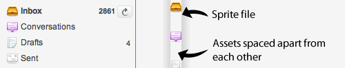
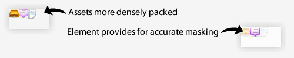

# 图标模块（The Icon Module）

[原文](https://smacss.com/book/icon-module)

CSS sprites have become a mainstay of modern web development—and for good reason. They allow for multiple assets to be compiled into a single resource, minimizing the number of HTTP requests and ensuring that images for things like rollover states are already loaded when needed.

CSS精灵已经成为现代Web开发的主要支柱 - 这是有一定道理的。它们允许将多个资源编译到一个资源中，最大限度地减少HTTP请求的数量，并确保在需要时已经加载了像翻转状态这样的图像。

Before sprites came along, images would be used in two different contexts: as a background image, allowing other things to layer on top of it; or as a foreground image, residing inline with text. With sprites, everything is now a background image and positioned within the mask of the element.

在CSS精灵出现之前，图像将被用在两种不同的情况下：作为背景图像，允许其他东西在其上显示; 或作为前景图像，位于文本旁边。随着CSS精灵的到来，现在都是作为一个背景图像存在，并定位在元素的表面。

It is this latter scenario that this chapter will be specifically addressing.

本章内容在后面章节会特别提到。

This will be best explained with an example, so let's look at a menu with its accompanying icons.

解释这个问题最好的方法就是举一个例子，让我们来看看一个带有图标的菜单。

带有图标的菜单（Menu of items with icons）



菜单的HTML代码（Menu HTML）

```
<ul class="menu">
    <li class="menu-inbox">Inbox</li>
    <li class="menu-drafts">Drafts</li>
</ul> 
```

The HTML is straightforward. We have a list of menu items. A class is added to each menu item so that we can style each one differently.

HTML很简单。我们有一个菜单项的列表。每个菜单项都添加一个类，以便我们可以对每个菜单项进行不同的设计。

菜单的CSS代码（Menu CSS）

```
.menu li {
    background: url(/img/sprite.png) no-repeat 0 0;
    padding-left: 20px;
}

.menu .menu-inbox {
    background-position: 0 -20px;
}

.menu .menu-drafts {
    background-position: 0 -40px;
}

```

All list items are set to the single sprite and then each individual list item repositions the background to show the correct icon.

所有列表项都设置为单个的精灵，然后每个单独的列表项会重新定位背景从而显示正确的图标。

On the surface, this looks pretty good and it worked for us, for the most part. As always, we began to run into edge cases where this complicated matters.

* We became reliant on a very specific HTML structure: the list item.
* Sprites had to be redefined to be used in other modules.
* Positioning within the element was very fragile: bumping up font size could reveal other parts of the sprite.
* Handling right-to-left interfaces was more difficult since we could only use horizontal sprites and fix the x position to 0.

从表面上看，这看起来相当不错，而且对我们来说大部分工作已经足够了。但是，与往常一样，我们会遇到带来问题的个别案例。

* 我们变得依赖于一个非常特定的HTML结构：列表项。
* 精灵不得不被重新定义以便在其他模块中使用。
* 元素内的定位是非常容易产生问题的：改变字体大小就会显示CSS精灵的其他部分。
* 处理从右到左的界面是比较困难的，因为我们只能使用水平精灵并将x的大小固定为0。

To resolve these issues, we moved to where the icon itself became a module: the icon module.

为了解决这些问题，我们将图标定义成一个模块：图标模块。

Restructuring the HTML to create the icon module

重构HTML代码以创建图标模块

```
<li><i class="ico ico-16 ico-inbox"></i> Inbox</li> 
```

Many people would likely balk at the use of the `i` tag. I chose to use it because it was small, mostly devoid of semantics, and was an empty element with no content. Why is there no content? In this example, the icon supports the visible text beside it. If the icon were to sit alone, then we would add a title attribute so that it could be read by a screen reader or used as a tooltip. If you disagree and feel a span is more appropriate, I'll understand.

很多人可能会不会考虑`i`标签。我选择使用它，因为它的体积很小，大部分没有语义，是一个没有内容的空元素。它为什么没有内容呢？在这个例子中，图标支持它旁边有可见的文本。如果图标是独立的，那么我们可以添加一个标题属性，以便它可以被屏幕阅读器读取或用作工具提示信息。如果您不同意，并感觉span更合适，我也可以理解。

By having a single tag with the various icon classes applied to it, it no longer has any other HTML dependencies. That's good. But why three different classes? Each plays a slightly different role and all ultimately come together to mimic a traditional `img` element.

通过将不同的图标类应用到单个标签，它不会依赖任何其他的HTML。那很不错。但为什么会有三个不同的类？因为每个类都会扮演一个稍微不同的角色，并最终合并到一起，模仿传统的`img`元素。

图标模块的CSS（Icon Module CSS）

```
.ico {
    display: inline-block;
    background: url(/img/sprite.png) no-repeat;
    line-height: 0;
    vertical-align: bottom;
}

.ico-16 {
    height: 16px;
    width: 16px;
}

.ico-inbox {
    background-position: 20px 20px;
}

.ico-drafts {
    background-position: 20px 40px;
}

```

The `ico` class defines the basics of turning the element into an inline-block element, which is what an image is. You may need to adjust `vertical-align` so that the icon sits relative to the text correctly. Internet Explorer has issues with applying `inline-block` to block elements. Since we're applying it to an inline element, it doesn't have the same issue. Alternatively, you can use `{ zoom:1; display:inline; }` for block elements in IE to behave like inline-block elements.

`ico`类定义了将元素转换为内联块级元素的基础，而图片恰恰也是一个内联块级元素。您可能需要调整`vertical-align`，以使图标相对于文本有正确的位置。Internet Explorer在应用`inline-block`来改变元素方面存在问题。由于我们将它应用于内联元素，因此它不会有相同的问题。或者说，您可以使用`{zoom：1; display:inline; }` 让块级元素在IE中表现为行内块元素。

The `ico-16` class sets the height and width. If your project only has one size of icon, you could define the size in the `ico` class. If every icon has a different size, you can define it in the class for the specific icon. For this project, we had sets of icons in about four different sizes.

`ico-16`会设置高度和宽度。如果您的项目只有一个尺寸的图标，那你可以在`ico`类中定义尺寸。如果每个图标的大小不同，您可以在类中为特定图标定义尺寸。对于目前这个项目，我们有大约四种不同尺寸的图标。

The last class, `ico-inbox`, positions the sprite to the correct coordinates. By having a fixed icon size, there's no longer a concern of the parent element growing too large and we can use the same code for right-to-left interfaces without having to modify the background position.

最后一个类是`ico-inbox`，它将精灵定位到正确的坐标上。通过固定图标的大小，我们不再需要担心父元素变得太大，我们可以使用相同的代码来实现从右到左的界面，而无需修改背景位置。

密集的图像精灵（Densely packed image sprite）



A more densely packed image also allows for better compression. Smaller file sizes will improve the performance of your site. (And if you're not already, I recommend using Yahoo!'s [Smush.it](http://www.smushit.com/ysmush.it/) service or [ImageOptim](http://imageoptim.pornel.net/) for the Mac to ensure your images are as small as possible.)

更密集的图像可以更好的被压缩。较小的文件大小将改善您的网站的性能。（如果你还没有开始准备，我建议您使用雅虎的[Smush.it](http://www.smushit.com/ysmush.it/)服务或对于Mac用户，使用[ImageOptim](http://imageoptim.pornel.net/)，以确保你的图像尽可能的小。）

We've just looked at an example of how to refactor a specific part of a project to make things more flexible. There are many ways to approach a problem and what looks like it'll work on the surface can run into problems further into a project. Projects evolve as complexities reveal themselves and part of the fun in doing web development is deciding how best to solve these problems.

我们刚刚看了一个如何重构项目中特定部分，从而使代码更加灵活的例子。还有很多解决问题的其他方法，它们在表面上看起来像可以正常使用，但随着项目复杂性的增加，可能会出现其他的问题，何况开发网站的一部分乐趣不就是如何最好地解决这些问题么？
