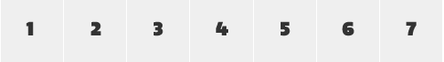
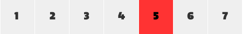
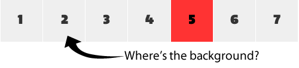

# 复杂的继承（Complicated Inheritance）

[原文](https://smacss.com/book/inheritance)

This chapter looks at how inheritance can sometimes cause our best laid plans to run afowl.

本章将着眼于如何使用继承来使得我们的计划可以更好的进行。

In this example, we will take a look at a Calendar that uses generic State rules that conflict with the inheritance within the table cells and how to possibly work around the problem.

在这个例子中，我们将看到一个使用通用状态规则的日历，这些规则会与表格单元格中的继承样式起冲突，我们会看看及如何解决这个问题。

日历表（Calendar Table）

```
<table class="cal">
    <tr>
        <td>1</td>
        <td>2</td>
        <td>3</td>
        <td>4</td>
        <td>5</td>
        <td>6</td>
        <td>7</td>
    </tr>
    <!-- repeated 3-4 times -->
</table>

```


The calendar consists of a table with rows and columns. Each cell is a single day. The default style is is how a day cell should look under normal circumstances.

日历由一个包含行和列的表组成。每个表格单元格代表一天。在正常情况下默认的样式是显示一天内的单元格。

日程单元格（The Day Cell）

```
.cal td {
    background-color: #EFEFEF;
    color: #333;
}

```



Each cell in my table has a light gray background with dark gray text. Now, we want to highlight which day is today.

在表格上的每个单元格都有着浅灰色背景并带有深灰色的文字。现在，我们要强调哪一天是今天。

当日单元格的样式（Styling Today）

```
.cal td.cal-today {
    background-color: #F33;
    color: #000;
}

```



The `cal-today` class shows that the today class is part of the `cal`module. We are also increasing the specificity which will have this style override the default style. Alternative selector choices could’ve included just a plain `td.cal-today` which would have worked as long as it was declared after the default state rule. Had we used just `.cal-today` as our selector, we would’ve had to resort to using `!important`to get this style to work.

`cal-today`的类表明，当日单元格的类是`cal`的一部分。我们在默认风格上添加新的样式以表示特殊性。其中一个可以使用的选择器可能只包含简单的`td.cal-today`，只要它在默认状态规则之后被声明就可以使用。如果我们今天选择`.cal-today`，我们不得不使用`！important`来让这种风格发挥作用。

It is important to recognize that there are small decisions that have to be made like this as the project develops. In the direction I chose, I’m saying that the `.cal-today` class can only be applied on a table cell (`<td>`) and that it would be inside an element with the `cal` class (which, using SMACSS, should be considered a given).

要注意到，随着项目的开发，我们必须做一些决定。从我的角度而言，`.cal-today`类只能应用于表格单元格（`<td>`），并且它会在一个`cal`类的元素里面（您也可以考虑使用SMACSS）。

Getting back to our example, everything looks good. Now, our calendar is a smaller view that is connected to a larger view that shows a week in full detail. Our miniature calendar needs to show which week is the currently selected week.

现在回到我们的例子中，一切看起来都还不错。此时，我们的日历表因为连接到一个显示整周细节的更大的视图上，所以看起来有点小。因此，我们的微型日历需要确定显示哪一周作为当前选定的一周。

选中的行（Selected Row）

```
<tr class="is-selected">
    <td>1</td>
    <td class="cal-today">2</td>
    <td>3</td>
    ...
</tr>

```

The selected state is being used throughout the application and so it only made sense to use it here. What does the selected style look like?

选中的状态会在整个应用程序中使用，并且它在这里会表达一定的意思。那您会选择什么样的风格呢？

选中的行的规则（Selected Row Rule）

```
.is-selected {
    background-color: #FFD700; /* Yellow */
    color: #000;
}
```



Can you see the problem? The problem is that the background colour applies to the table row while the color inheritance gets overridden by the greater specificity of both the base day style and the today style.

你能看到哪里出了问题吗？问题就在于背景颜色被应用到了表格的行中，而颜色则是被非当日的风格和当日风格更大的差异性所覆盖。

I could add `!important` to my state, which I have mentioned above as being an acceptable thing to do, but while it increases the specificity when applying the style to the same element, it doesn’t help us here because it won’t be inherited down to the cell. `!important` does not override inheritance, just specificity.

在这里，我可以为我的状态加上`important`，在上面我提到这是可以接受的事情。但是当把样式应用到相同的元素时，它增加了样式的特殊性，它并不会继承到单元格的样式，所以它对我们并没有什么帮助。这里有个特殊的地方，就是`important`不会覆盖继承。

That means I need to create new rules to allow the selected state to be reflected on child elements.

这意味着我需要创建新的规则让选中的状态可以在子元素上显示出来。

在表格单元中选中的行的规则（Selected Row Rule for Table Cells）

```
.is-selected td {
    background-color: #FFD700; /* Yellow */
    color: #000;
}
```


If this selector is defined after our calendar day selectors then everything should render just as we would expect.

如果这个选择器是在我们的日历的日选择器之后定义的，那么所有的东西都应该像我们预期的那样渲染。

What colour will our cells be now? That depends. Was this style declared before or after the `cal` classes? If it was after, then all cells in the row will be styled correctly. Our today cell will still be coloured in red, which, on this particular project, was exactly what we wanted.

我们的单元格现在会变成什么颜色？这要视情况而定。这个样式是在`cal`类之前声明的还是之后声明的？如果在之后声明，则该行中的所有单元格都会被正确的渲染。现在的单元格被渲染成红色，在这个项目中，这正是我们想要的。

## `!important`在哪里会出错（Where !important can go wrong）

For argument’s sake, what if we added the `!important` rule to our select cell CSS? Suddenly our today cell would no longer show today; it would be styled like the rest of the week.

为了验证我们的论点，如果我们将`!important`的规则添加到我们选中的单元格的CSS中呢？那么，我们当日的单元格不再显示当日的样式; 而是呈现其他日期的样式。

应该在哪里使用`!important`（What adding `!important` would do）

```
.is-selected td {
    background-color: #FFD700 !important; /* Yellow */
    color: #000 !important;
}
```


To get the today cell styled correctly, we would have to create a new rule that combines the state rule with the module rule.

为了让今日单元格的样式正确显示，我们会创建一个包括状态规则和模块规则的新的规则。

添加额外的规则来解决特定问题（Adding extra rules to work around specificity）

```
.is-selected td {
    background-color: #FFD700 !important; /* Yellow */
    color: #000 !important;
}

.is-selected td.cal-today {
    background-color: #F33 !important;
    color: #000 !important;
}

```

From this last example, you can see that we are having to add more selectors and more `!important` to keep things working correctly. This is definitely not ideal.

从最后一个例子中，您可以看到我们使用了更多的选择器和更多的`important`以确保事物都可以正确显示。这显然不是我们想要的。

## 一个不完美的世界（An Imperfect World）

The purpose of this example was to demonstrate that inheritance can wreak some havoc on our well-laid plans and there isnʼt a perfect solution. SMACSS tries to mitigate many of these problems but at the end of the day, sometimes you still have to create some less-than-ideal solutions.

这个例子的目的是为了证明继承可以对我们精心制定的计划造成一定的破坏而且还没有一个完美的解决方案。SMACSS试图减少许这些问题，但是有的时候您仍然需要创建一些不太理想的解决方案来解决问题。

Minimizing the number of situations like these will still help keep your project more maintainable.

尽量减少这些情况的数量会有助于保持项目的可维护性。

